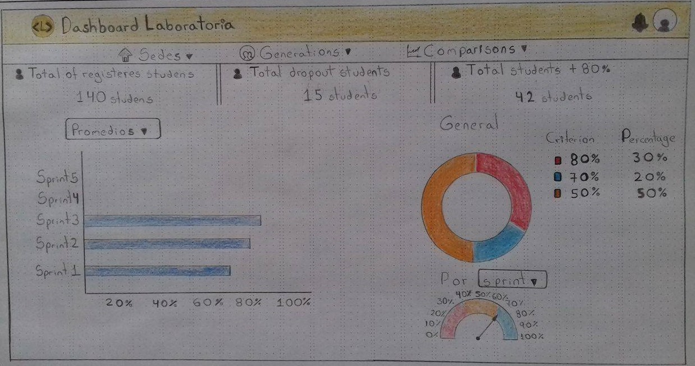

# Sketch - Dashboard de Laboratoria

## Objetivo

- El objetivo de este reto es crear un sketch del dashboard que crearemos para Laboratoria, ya que será utilizada por profesores, training managers, directores y gerentes de Laboratoria para ver rápidamente qué está pasando en el salón de clases de Laboratoria. En el dashboard, los usuarios podrán ver rápidamente estadísticas y datos en tiempo real como:

    - número de alumnas inscritas
    - número de alumnas que desertaron
    - número y % de alumnas que pasan el criterio mínimo de evaluación
    - Promedio de notas por sprint 
    - Promedio de notas HSE 
    - Promedio de notas técnicas

## Resultado

Para realizar el dashboard, he utilizado elementos de navegación como los globales y facetados, esto para una mayor optimizacion del espacio, ya que es recomendable hacer los dashboard en una sola hoja. Los numeros y porcentajes no son exactos, pero estan basados en lo que se sabe de forma general.

## Imagen

